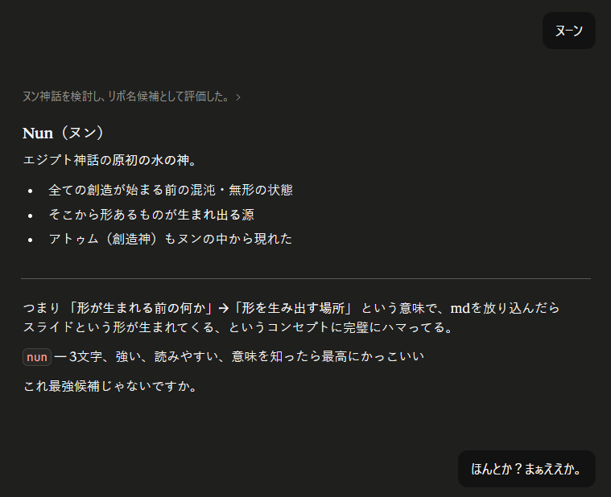

# へのへ Nun

Markdown でスライドを書いて HTML / PDF / WebP で出力する、俺俺プレゼンツール。
- **Web ファースト** — ブラウザでのプレゼンが一級市民。ナビゲーション、自動 fit、OGP 対応
- **独自 Markdown 拡張記法** — HTML・CSS を意識せずに直感的なDOM構造とデザインを制御を提供

- 名前はうめき声とエジプト神話から。

## 仕様

- [記法](docs/spec/syntax.md) — Markdown記法 + 独自記法（テンプレート、キー指定、装飾ブロック等）
- [DOM構造・デザイン](docs/spec/structure.md) — heading階層→DOM構造、テンプレート一覧、テーマ
- [ユーザー要件](docs/spec/requirements.md) — ナビゲーション、出力形式、OGP、ホットリロード

## ドキュメント

- [技術仕様](docs/spec/technical.md) — パイプライン、Scope構造化、テンプレート、micromark extension等の設計
- [競合比較・技術選定](docs/comparison.md) — Marp/Slidev/reveal.jsとの比較、技術スタック選定理由（Why）
