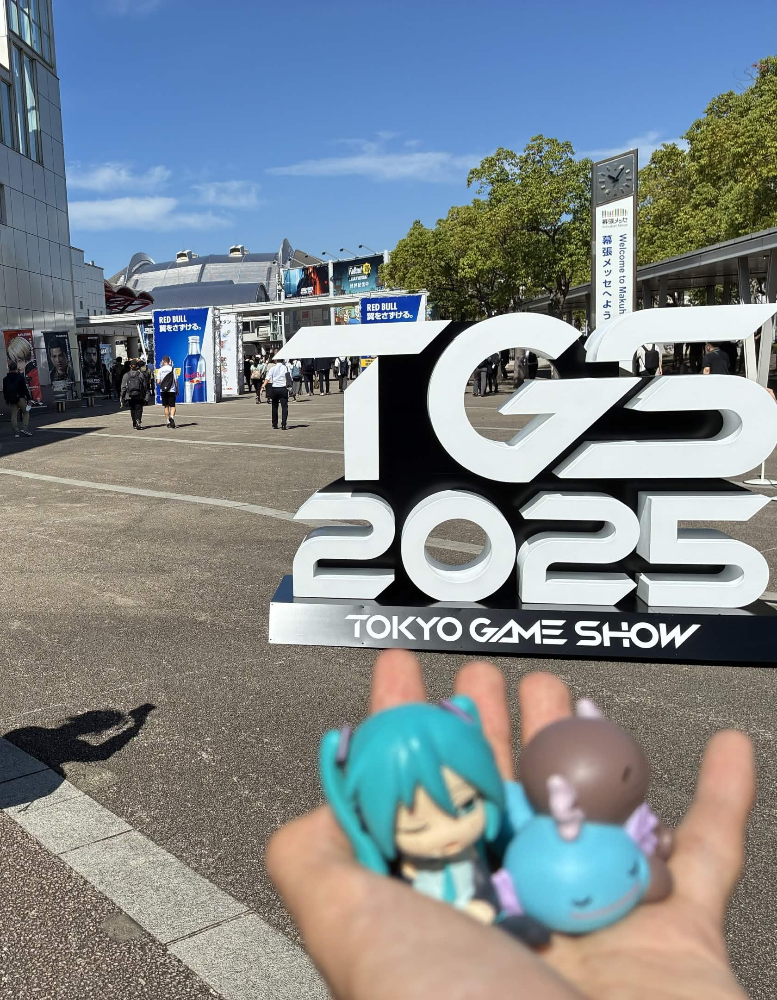

~~~meta
title: Web技術でイイ感じのゲーム開発
description: Marp spike
~~~

!fr~2026/09/20


# Web技術でイイ感じのゲーム開発
🌊title
!sub~henohenon

# 快適な環境
🌊solo
!fl~快適な環境

# Dev Loop
🌊default
!fl~快適な環境

- Unity
  - エディタに戻る → 再コンパイル + ドメインリロード
  - ==数秒〜数十秒==
- 今回の
  - 保存した瞬間、Vite が変更されたモジュールだけ差し替え (HMR) !fn[hmr]
  - 数ms

:::note 補足
Vite 以外でも HMR はある
:::

# それでも軽いのは Web
!fl~クオリティ

| | Three.js | Unity WebGL |
| --- | ---: | ---: |
| 配信サイズ | 109 KB | 4.3 MB |

```ts:main.ts
const scene = new THREE.Scene()
```

#
🌊default
!fl~茶番

```embed_svg
<svg viewBox="0 0 400 120" xmlns="http://www.w3.org/2000/svg" style="width:100%;height:auto"><circle cx="60" cy="60" r="50" fill="#5932ff"/><text x="140" y="70" font-size="32">embed_svg</text></svg>
```

!card[Vite](https://vite.dev)

# HMR とは
!fn~[hmr]
!fl~脚注

Hot Module Replacement。ページを再読み込みせずにモジュールを差し替える。

# こういう時にイイ感じ
🌊message
!fl~まとめ
!lead~最適ではない。でも、悪くない

# 写真
!fl~画像



[vite.dev へのリンク](https://vite.dev)
