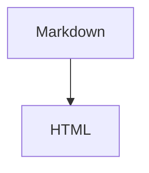

# 記法

基本的なmarkdown記法をベースに、てんこ盛りにしつつ、一部独自記法を採用したやつ

**基本方針**
- Markdownとして読めることを優先する。
- MarkdownやCSS classの記法の延長としての拡張。
- CSSやHTMLを直接意識せずに書けることを意識。

**独自記法について**
- スライドのデザイン指定、Markdownの機能拡張を行う。
- Nunから水モチーフのキーワードを使用している`~`, `🌊`。

## markdown記法

### 見出し

```Markdown
# 見出し1
## 見出し2
### 見出し3
#### 見出し4
##### 見出し5
###### 見出し6
```

### 改行

改行はそのまま `<br>` として反映される。改行の数がそのまま改行数になる。

```Markdown
1行目
2行目

3行目(1行空き)


4行目(2行空き)
```

### 強調

```Markdown
*斜体*
_斜体_

**太字**
__太字__
==ハイライト==

***太字斜体***
___太字斜体___
```

### 打ち消し線

```Markdown
~~打ち消し線~~
```

### 箇条書きリスト

```Markdown
- item
- item
  - nested item
  - nested item

* item
* item

+ item
+ item
```

### 番号付きリスト

```Markdown
1. item
2. item
3. item
```

番号は自動補正されるため、すべて`1.`でもよい。

```Markdown
1. item
1. item
1. item
```

### チェックリスト

```Markdown
- [ ] 未完了
- [x] 完了
```

### 装飾ブロック

補足、情報、ヒント、注意、警告などのまとまった情報を強調表示する。

```Markdown
:::note
補足
:::

:::info
情報
:::

:::tip
ヒント
:::

:::warning
注意
:::

:::alert
警告
:::
```

| 種類 | 用途 |
| --- | --- |
| `note` | 補足、メモ |
| `info` | 追加情報 |
| `tip` | ヒント、推奨 |
| `warning` | 注意 |
| `alert` | 強い警告 |

#### 折りたたみ

種類の後ろに `+` / `-` を付けると、折りたたみブロックになる。

| 記法 | 用途 |
| --- | --- |
| `:::note+` | 折りたたみ可能、初期状態は開く |
| `:::note-` | 折りたたみ可能、初期状態は閉じる |

```Markdown
:::note+ 開いた補足
最初から開いている。
:::

:::warning- 閉じた注意
最初は閉じている。
:::
```
#### タイトル

種類の後ろに空白区切りでタイトルを指定できる。

```Markdown
:::note タイトル
本文
:::

:::warning- 閉じた注意
最初は閉じている。
:::
```

タイトルを省略した場合は、種類に応じたデフォルトタイトルを表示する。

```Markdown
:::<type><fold?> <title?>
```

### 引用

```Markdown
> 引用文
> 複数行の引用文

> 引用
>> ネストした引用
```

### インラインコード

```Markdown
`const value = 1`
```

### コードブロック
左上に言語名(ファイル名)、右上にコピーボタンを持つヘッダー付きの形式。

````Markdown
```js
const value = 1;
console.log(value);
```
````


#### ファイル名指定

````Markdown
```js:main.js
const value = 1;
console.log(value);
```
````

以下の拡張記法を使える。

| 記法                         | 用途              |
|----------------------------|-----------------|
| `` ```<lang> ``            | 言語指定            |
| `` ```<lang>:<name> ``     | ファイル名指定         |
| `` ```<lang>#<n> ``        | ファイル番号指定        |
| `` ```<lang>:<name>#<n> `` | ファイル名 + 番号指定    |
| `` ```diff_<lang> ``       | 差分表示            |
| `` ```embed_<type> ``      | 内容を埋め込み要素として描画  |


#### ファイル番号指定
````Markdown
```js#1
const value = 1;
console.log(value);
```
````

ファイル名と番号は組み合わせて指定できる。

````Markdown
```js:main.js#1
const value = 1;
console.log(value);
```
````

#### 差分表示
````Markdown
```diff_js
-const value = 1;
+const value = 2;
console.log(value);
```
````
#### 埋め込み表示
`embed_*` を指定した場合は、内容をコードではなく描画・埋め込みとして扱う。

| 記法                     | 用途 |
|------------------------| --- |
| `` ```embed_html ``    | HTMLとして埋め込み |
| `` ```embed_svg ``     | SVGとして描画 |
| `` ```embed_mermaid `` | Mermaid図として描画 |
| `` ```embed_math ``    | 数式として描画 |

````Markdown
```embed_html
<div class="example">
  HTMLとして埋め込む
</div>
```
````

````Markdown
```embed_svg
<svg viewBox="0 0 100 100">
  <circle cx="50" cy="50" r="40" />
</svg>
```
````

````Markdown
```embed_mermaid
flowchart TD
  A[Markdown] --> B[HTML]
```
````

(通常は `$...$` / `$$...$$` を使い、明示的にコードフェンスで数式を描画したい場合は `embed_math` を使う。)

````Markdown
```embed_math
E = mc^2
```
````

`HTML` / `svg` / `mermaid` / `latex` を指定した通常のコードブロックは、コードとして表示される。

````Markdown

````

### 水平線

```Markdown
---

***

___
```

### 数式

LaTeX記法による数式を使える。描画には KaTeX を使う。

インライン数式は `$...$` で書く。

```Markdown
インライン数式は $a^2 + b^2 = c^2$ のように書く。
```

ブロック数式は `$$...$$` で書く。

```Markdown
$$
E = mc^2
$$
```

LaTeXをコードとして表示したい場合は、通常のコードブロックとして `latex` を指定する。

````Markdown
```latex
E = mc^2
```
````

### リンク

```Markdown
[リンクテキスト](https://example.com)
```

タイトル付きリンク。

```Markdown
[リンクテキスト](https://example.com "タイトル")
```

### 画像

```Markdown

```

タイトル付き画像。

```Markdown

```

### テーブル

```Markdown
| name | description |
| ---- | ----------- |
| foo  | foo text    |
| bar  | bar text    |
```

配置指定。

```Markdown
| left | center | right |
| :--- | :----: | ----: |
| a    | b      | c     |
```
### エスケープ

Markdown記法として解釈されたくない文字は `\` でエスケープする。

```Markdown
\# 見出しにしない
\*強調にしない\*
\`コードにしない\`
\🌊テンプレートに.しない
\!key~valueにしない
```

### 脚注

脚注はひとまず専用記法としては扱わず、通常のリンクとして書く。
参考・出典などをまとめたスライドへリンクする想定。

```Markdown
本文中の脚注風リンク[[^1]](#10)
```

リンク先には、参考・出典用のスライドなどを指定する。

```Markdown
# 参考・出典

1. 脚注の内容
```

### コメント

```Markdown
<!-- コメント -->
```

## テンプレート記法
スライド内部のデザインは後述するテンプレートとそれに対するクラス指定のみで構成される。
headingタグ階層(以下、階層)のルート要素に指定されたクラスを追加し、それを外部CSSファイルによって解釈する。
これにより、Markdown記述からDOM構造/CSSを廃す。

### テンプレート指定
`🌊<template_name>`
そのheadingタグ階層(以下、階層)のDOM構造/デザインテンプレートを決定する。
1つの階層につき1つのみ指定可能。(2つ以上ある場合は一番上のみ採用)

(半角英数以外を使うのが頭がおかしいのはわかりつつ、ロマンに耐えきれんかった
### クラス指定
`🌊<template_name>.<class_name>`
その階層にclassを指定し、デザインを変更する。
複数を繋げて指定可能`🌊default.my-class.another-class`。

その階層のルート要素にクラスが指定される。内部のbodyのみに指定したい場合は`.body-row`のように指定することを想定。
CSS変数もクラス経由でCSSファイルで指定する。
UnoCSSクラスは一応指定できるが、基本非推奨。

## キー指定拡張
テキストと画像をキー:バリュー型で指定でき、それらは全体の装飾と各テンプレートによって解釈、反映される。

### 画像
`!<key>[<alt>](<url>)`
class指定で、位置や見た目の調整が可能`!bg.class[<alt>](<url>)`。

装飾
- bg
- fbg
テンプレート
- me
  - icon

### テキスト
`!<key>~<value>`
画像と同様にclass指定が可能`!fr.class~テキスト`。
装飾
- fl
- fr
テンプレート
- title
  - sub
- note
  - lead

### カード
`!card[<alt>](<url>)` でリンク先のOGP情報を取得し、カード形式で表示する。
他のキー指定と異なり、行はコンテンツとして残る（消費されない）。

取得する情報:
- タイトル（og:title）
- 説明文（og:description）
- サムネイル画像（og:image）
- ファビコン

レイアウト:
- 横型（デフォルト）: 左にサムネイル、右にタイトル・説明・URL
- 縦型（`.v`）: 上にサムネイル、下にタイトル・説明・URL

## グローバル指定
これらのテンプレートとキー指定については、最初のh1より上で指定した場合、これらは全体のデフォルト設定となる。
特に全体のクラスや共通装飾として、`🌊.dark`や`!fl~スライドタイトル`のように使う想定

## メタ情報の記述
`key: value`のメタ情報ブロック
```Markdown
~~~meta
~~~
```
今は一覧のソート用のdateだけ。
