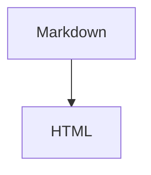

# 記法

基本的なmarkdown記法をベースに、てんこ盛りにしつつ、一部独自記法を採用したやつ

**基本方針**
- Markdownとして読めることを優先する。
- MarkdownやCSS classの記法の延長としての拡張。
- CSSやHTMLを直接意識せずに書けることを意識。

**独自記法について**
- スライドのデザイン指定、Markdownの機能拡張を行う。
- Nunから水モチーフのキーワードを使用している`~`, `🌊`。

## markdown記法

### 見出し

```Markdown
# 見出し1
## 見出し2
### 見出し3
#### 見出し4
##### 見出し5
###### 見出し6
```

### 改行

改行はそのまま `<br>` として反映される。改行の数がそのまま改行数になる。

```Markdown
1行目
2行目

3行目(1行空き)


4行目(2行空き)
```

### 強調

```Markdown
*斜体*
_斜体_

**太字**
__太字__
==ハイライト==

***太字斜体***
___太字斜体___
```

### 打ち消し線

```Markdown
~~打ち消し線~~
```

### 箇条書きリスト

```Markdown
- item
- item
  - nested item
  - nested item

* item
* item

+ item
+ item
```

### 番号付きリスト

```Markdown
1. item
2. item
3. item
```

番号は自動補正されるため、すべて`1.`でもよい。

```Markdown
1. item
1. item
1. item
```

### チェックリスト

```Markdown
- [ ] 未完了
- [x] 完了
```

### 装飾ブロック

補足、情報、ヒント、注意、警告などのまとまった情報を強調表示する。

```Markdown
:::note
補足
:::

:::info
情報
:::

:::tip
ヒント
:::

:::warning
注意
:::

:::alert
警告
:::
```

| 種類 | 用途 |
| --- | --- |
| `note` | 補足、メモ |
| `info` | 追加情報 |
| `tip` | ヒント、推奨 |
| `warning` | 注意 |
| `alert` | 強い警告 |

#### タイトル

種類の後ろに空白区切りでタイトルを指定できる。

```Markdown
:::note タイトル
本文
:::
```

タイトルを省略した場合は、種類に応じたデフォルトタイトルを表示する（デフォルトは英語: Note, Info, Tip, Warning, Alert）。

```Markdown
:::<type> <title?>
```

#### ネスト・ブロック要素

装飾ブロック内にはリスト、コードブロック等のブロック要素を含められる。内容は flow content として再帰パースされる。
装飾ブロックをネストする場合は、外側のコロンを増やして区別する。

````Markdown
::::note 外側
:::tip 内側
ネストされた装飾ブロック
:::
::::
````

### 引用

```Markdown
> 引用文
> 複数行の引用文

> 引用
>> ネストした引用
```

### インラインコード

```Markdown
`const value = 1`
```

### コードブロック
左上に言語名(ファイル名)、右上にコピーボタンを持つヘッダー付きの形式。
（CommonMark 仕様上 `~~~` でもコードフェンスとして使える。`~~~meta` と同様、圧縮などで使い分けると面白い。推奨は `` ``` ``。）

````Markdown
```js
const value = 1;
console.log(value);
```
````


#### ファイル名指定

````Markdown
```js:main.js
const value = 1;
console.log(value);
```
````

以下の拡張記法を使える。

| 記法                         | 用途              |
|----------------------------|-----------------|
| `` ```<lang> ``            | 言語指定            |
| `` ```<lang>:<name> ``     | ファイル名指定         |
| `` ```<lang>#<n> ``        | 開始行番号指定          |
| `` ```<lang>:<name>#<n> `` | ファイル名 + 開始行番号指定 |
| `` ```diff_<lang> ``       | 差分表示            |
| `` ```embed_<type> ``      | 内容を埋め込み要素として描画  |


#### 開始行番号指定

`#<n>` を指定した場合のみ行番号を表示する。省略時は行番号なし。`#0` なら 0 行目から、`#100` なら 100 行目から連番で表示される。

````Markdown
```js#10
const value = 1;   // 10
console.log(value); // 11
```
````

ファイル名と組み合わせて指定できる。

````Markdown
```js:main.js#10
const value = 1;   // 10
console.log(value); // 11
```
````

#### 差分表示
````Markdown
```diff_js
-const value = 1;
+const value = 2;
console.log(value);
```
````
#### 埋め込み表示
`embed_*` を指定した場合は、内容をコードではなく描画・埋め込みとして扱う。

| 記法                     | 用途 |
|------------------------| --- |
| `` ```embed_html ``    | HTMLとして埋め込み |
| `` ```embed_svg ``     | SVGとして描画 |
| `` ```embed_mermaid `` | Mermaid図として描画 |
| `` ```embed_math ``    | 数式として描画 |

````Markdown
```embed_html
<div class="example">
  HTMLとして埋め込む
</div>
```
````

````Markdown
```embed_svg
<svg viewBox="0 0 100 100">
  <circle cx="50" cy="50" r="40" />
</svg>
```
````

````Markdown
```embed_mermaid
flowchart TD
  A[Markdown] --> B[HTML]
```
````

(通常は `$...$` / `$$...$$` を使い、明示的にコードフェンスで数式を描画したい場合は `embed_math` を使う。)

````Markdown
```embed_math
E = mc^2
```
````

`HTML` / `svg` / `mermaid` / `latex` を指定した通常のコードブロックは、コードとして表示される。

````Markdown

````

### 水平線

```Markdown
---

***

___
```

### 数式

LaTeX記法による数式を使える。描画には KaTeX を使う。

インライン数式は `$...$` で書く。

```Markdown
インライン数式は $a^2 + b^2 = c^2$ のように書く。
```

ブロック数式は `$$...$$` で書く。

```Markdown
$$
E = mc^2
$$
```

LaTeXをコードとして表示したい場合は、通常のコードブロックとして `latex` を指定する。

````Markdown
```latex
E = mc^2
```
````

### リンク

```Markdown
[リンクテキスト](https://example.com)
```

タイトル付きリンク。

```Markdown
[リンクテキスト](https://example.com "タイトル")
```

### 画像

```Markdown

```

タイトル付き画像。

```Markdown

```

画像は `public/` ディレクトリに配置し、`/` 始まりの絶対パスで参照する。

#### クラス指定（nwyt 拡張）

`!.class1.class2[alt](url)` で class 属性付きの `` を出力する。 標準の markdown image (``) に対して `.class` 部分を挟む形。 UnoCSS class や独自 CSS class を直接当てたい時に使う。

```Markdown
!.rounded-lg.shadow-xl[ロゴ](/logo.png)
```

class 名に使える文字は `[a-zA-Z0-9_%-]` のみ。 `%` は image utility の Nudge token (`tx-10%` `ty--50%`、 詳細は下記「image utility class」 節) 用に許可。 先頭文字は alphanumeric または `^` (subtract prefix、 `^mono` で継承 class list から `mono` を抜く)。 UnoCSS の高度な記法 (`bg-[#5932ff]` の `[` `]`、 `lg:hover:text-blue-500` の `:`、 `w-1/2` の `/` 等) は未対応。 必要なら CSS 側で当てるかカスタム class を介する。

### テーブル

```Markdown
| name | description |
| ---- | ----------- |
| foo  | foo text    |
| bar  | bar text    |
```

配置指定。区切り行の `:` の位置で各列のテキスト寄せを決める。

| 区切り | 寄せ |
| :--- | :--- |
| `:---` または `---` | 左寄せ (デフォルト) |
| `:---:` | 中央寄せ |
| `---:` | 右寄せ |

```Markdown
| left | center | right |
| :--- | :----: | ----: |
| a    | b      | c     |
```

remark-gfm が `<th align="...">` / `<td align="...">` の HTML 属性で出力し、CSS 側がそれに合わせて `text-align` を当てる。
### エスケープ

Markdown記法として解釈されたくない文字は `\` でエスケープする。
標準 Markdown の `\` + ASCII 記号に加え、独自記法（`🌊`, `!`）も自前 micromark extension 内で `\` を先読みしてエスケープ対応する。

```Markdown
\# 見出しにしない
\*強調にしない\*
\`コードにしない\`
\🌊テンプレートにしない
\!key~valueにしない
```

### 脚注

本文中に `!fn[id]` で脚注参照マークを配置する（コンテンツとして残る）。
脚注の定義は nwyt prop `!fn~[id]` でその scope (section / article どちらも可) をマークする（消費される）。定義側 scope の body 全体が脚注内容となる。

```Markdown
## 脚注1の内容
!fn~[1]

脚注の内容テキスト。この article の body 全体が脚注内容として扱われる。

## 本文
本文中のテキスト !fn[1] ここに上付き参照マークが入る。
```

- 参照マーク（`!fn[id]`）は上付きで表示される。
- ホバーで tooltip として脚注内容を表示する。
- クリックで定義がある article のスライドページに遷移する。
- 定義側の article のタイトル左に `[^id]` マークが付く。
- 脚注内容は tooltip 用の hidden 要素と、定義側 article の本文の両方に存在する。
- tooltip にはデフォルトで scope の body のみが含まれる。`!fn.head~[id]` のように `.head` クラスを付けると heading も含まれる (section 単位で脚注を定義する用途で文脈付きで見せたい時に使う)。

### コメント

```Markdown
<!-- コメント -->
```

## テンプレート記法
スライド内部のデザインは後述するテンプレートとそれに対するクラス指定のみで構成される。
headingタグ階層(以下、階層)のルート要素に指定されたクラスを追加し、それを外部CSSファイルによって解釈する。
これにより、Markdown記述からDOM構造/CSSを廃す。

### テンプレート指定
`🌊<template_name>`
そのheadingタグ階層(以下、階層)のDOM構造/デザインテンプレートを決定する。
1つの階層につき1つのみ指定可能。(2つ以上ある場合は後勝ち)

(半角英数以外を使うのが頭がおかしいのはわかりつつ、ロマンに耐えきれんかった)
### クラス指定
`🌊<template_name>.<class_name>`
その階層にclassを指定し、デザインを変更する。
複数を繋げて指定可能`🌊default.my-class.another-class`。

その階層のルート要素にクラスが指定される。内部のbodyのみに指定したい場合は`.body-row`のように指定することを想定。
CSS変数もクラス経由でCSSファイルで指定するのが原則。1 回限りの例外として nwyt の var inline syntax (`!<prefix>-<name>~<value>`, 下記参照) を用意。
UnoCSSクラスは一応指定できるが、基本非推奨。

### クラス名前空間ルール

クラスは指定する mechanism (= 適用 target) によって 4 つの名前空間に分かれる。

| mechanism | syntax | 適用 target | 命名規則 |
|---|---|---|---|
| **img-direct** | `!.<class>[alt](url)` | `` 直接 | simple short 名 (image utility namespace) |
| **bg/fbg** | `!bg.<class>~[alt](url)` / `!fbg.<class>~[alt](url)` | wrapper 内の `` / `` | 同上 (img-direct と共通) |
| **scope** | `🌊<name>.<class>` | section / article 容器 | semantic descriptive (`.hierarchy` `.window` 等) |
| **var inline** | `!<prefix>-<name>~<value>` | scope の CSS var を直接 set | category prefix (`color-*` `size-*`) |

#### image utility class (統一 namespace)

img-direct / bg / fbg / icon の全 image-mechanism で **同一 class が同一概念**。 適用先は常に `` 要素 (wrapper の `<div.bg-layer>` 等ではなく、 その中の `` 本体)。 例:
- `!.cover[](url)` → `` (body 内、 親要素を覆う)
- `!bg.cover~[](url)` → `<div class="bg-layer"></div>` (section 内 inner img を覆う)
- `!icon.round~[](url)` → me template の icon img が 角丸

**bg/fbg の注意**: class は **wrapper でなく inner img を動かす**。 wrapper (`<div.bg-layer>` / `<div.fbg-layer>`) は section 全体を覆う固定の positioning context (mask 適用先) で位置を変えない。 これにより:
- bg では `.at-bl.sm` で img が section 内 bottom-left の 40cqmin 区画に表示 (期待通り)
- fbg では mask が wrapper (= section bottom の footer 形状領域) に固定なので、 inner img を `.at-bl.sm` で動かすと **mask 領域と img 領域の交差部分**だけ可視になる (footer の中の特定部分しか塗られない)。 fbg の visible area 自体を動かしたい場合は mask 構築の改修が必要 (現状 scope 外)

`.at-*` は `position: absolute` + `inset` の 0/auto pattern + `margin: auto` で位置決め。 transform を使わないので CSS `translate` プロパティ枠が空いており、 `.tx-*` / `.ty-*` (下記 Nudge) で微調整できる。

| カテゴリ | classes | 効果 |
|---|---|---|
| Layout (排他) | `.cover` / `.at-{tl,t,tr,l,c,r,bl,b,br}` | 親要素内での位置 (cover = 全面、 at-* = 9 セル grid) |
| Nudge (複合可) | `.tx-<n><unit>` / `.ty-<n><unit>` | translate で位置微調整 (`.at-*` 上に乗せる) |
| Opacity | `.op-<n>` | `opacity: n/100` (n = 0-100 integer、 Tailwind 互換) |
| Subtract | `.^<class>` | 継承 class list から `<class>` を除去 (global 上書きしたい時) |
| Size (排他) | `.sm` / `.md` / `.lg` / `.xl` | 40 / 60 / 80 / 100 cqmin |
| Shape | `.round` / `.circle` | 角丸 / 円形クロップ |
| Aspect (排他) | `.aspect-{square,video,portrait}` | aspect-ratio 1:1 / 16:9 / 9:16 |
| Effects (複合可) | `.dim` / `.haze` / `.mono` / `.invert` / `.fade` / `.shadow` / `.frame` / `.tint-brand` / `.flip-{h,v}` | filter / blend / transform 系 |

##### Nudge / Opacity hoist + Subtract 詳細

`.tx-` / `.ty-` / `.op-` token は class ではなく inline `style` 属性へ hoist され、 `^<name>` token は継承 class list から `<name>` を除去する (`src/image-style-hoist.ts`)。 任意 value (単位 / 0-100 range) を class 名前空間制約 (`[a-zA-Z0-9_%-]`) に縛られず使えるようにし、 また global / value-ref で継承された class の打ち消しを可能にするための変換層。

**Nudge (`.tx-` / `.ty-`)**: `.at-*` の 9 セル positioning の上から CSS `translate` で微調整。 値部分は `<n><unit>` 形式で、 単位は `%` `px` `em` `rem` `cqmin` `cqmax` `vh` `vw` 等を直書きできる。 負号は token 先頭 `-` (例: `.ty--50%`)。 片軸のみ指定可 (他軸 0 暗黙)、 同軸重複は後勝ち。

**Opacity (`.op-`)**: `op-<n>` で n = 0-100 integer (Tailwind 互換)、 `opacity: n/100` として出力 (`.op-30` → `opacity: 0.3`)。 0-100 範囲外は class として残る (UnoCSS `opacity-*` 等に委譲)。

**Subtract (`^<class>`)**: 継承 class list (global → scope merge や value-ref `=fbg` で集まったもの) から指定 class を除去。 例: global `!fbg.at-br.lg.mono~[](url)` の上で scope `!fbg.^mono~` を書くと `mono` だけ消えて他は維持。 対象 class が無くても error 無し (no-op)。 `^<class>` 自体も出力に残らない。 hoist token (`^tx-...` 等) は組合せ無効 (token 名が一致しないため落ちる)。

```Markdown
!bg.at-br.tx--10px.ty--10px~[bg](/img.png)
!fbg.at-br.ty-20%~[fbg](/img.png)
!.at-c.ty--2cqmin.op-50[icon](/icon.png)
!fbg.^mono~                                 # global fbg から mono のみ抜く
```

- 形式不正 (`tx-abc` `op-200` 等) は通常 class として残る (UnoCSS 等に委譲)
- class 名前空間ルールの「単位 `%` 許可」 は `.tx-/.ty-` token のためだけの例外、 「先頭 `^` 許可」 は subtract token のためだけの例外

#### scope class

section / article 容器に付与、 配下に効く。 既存と新規:

- `.dark` — `data-theme="dark"` で token swap (section / global)
- `.hierarchy` — h1-h6 を 4 段配色
- `.window` — 枠 + 影 (browser window 風)
- `.brand-quote` — scope 内 blockquote を brand 色寄せ
- `.code-bare` — code block の figcaption (lang label + copy ボタン) を削除
- `.no-footer` — この slide だけ footer / fbg を非表示 (global `!fl/!fr` 継承を抜く)
- `.table-zebra` — scope 内 table をストライプ装飾
- `.table-bordered` — scope 内 table の全 cell に罫線

semantic descriptive な命名、 `🌊<template>.<class>` で適用。

#### UnoCSS class

UnoCSS の単純 numeric (`opacity-30` `w-80` `text-2xl`) は parser 制約 `[a-zA-Z0-9_%-]` を通る。角括弧記法 (`bg-[#5932ff]`)、 高度修飾子 (`lg:hover:foo`)、 fraction (`w-1/2`) は parser reject。 ad-hoc な fine-tuning 用、 通常は image utility / scope class を使う。

## nwyt（キー指定拡張）
`!key` で始まる記法の総称。prop と content の2種がある。

### prop（`!key~value`）
heading スコープのプロパティとして消費される（コンテンツに残らない）。
段落の先頭が `!key~` で始まる場合のみ認識され、その段落全体が nwyt prop として消費される。
value は Markdown テキスト。画像も `!bg~[alt](url)` のように Markdown 画像記法で指定する。
class指定が可能`!fr.class~テキスト`。

nwyt prop はグローバル指定で全 section・全 article に継承される。各 prop をどのレベルで解釈するかはテンプレート次第。対応テンプレート外で指定された固有 prop（例: default で `!icon`）は渡されるが解釈されず無視される。
同一スコープに同じ key の prop が複数ある場合は後勝ち。

section テンプレートで使用:
- `!bg~[alt](url)` — 背景画像
  - 値 reference 構文 `!bg~=<key>` で他 nwyt (典型的には fbg) の値を mirror できる (例: `!bg~=fbg` で fbg の URL を bg にも使う、 同 URL を 2 回書かない shortcut)。 chain (=A → =B) は無効 (depth 0)、 自己参照も無効
  - class 継承: `!bg~=fbg` のように bg 自身に class が無い場合、 参照先 (fbg) の class も継承する (= fbg の設定全部を bg にも適用)。 bg 独自 class があれば そちら優先 (`!bg.cover~=fbg` で URL は fbg、 class は `.cover`)
- `!fbg~[alt](url)` — フッター背景画像
- `!fl~テキスト` — フッター左テキスト
- `!fr~テキスト` — フッター右テキスト

特定テンプレートで使用:
- `!icon~[alt](url)` — me テンプレートのアイコン画像
- `!sub~テキスト` — title テンプレートのサブタイトル
- `!lead~テキスト` — message テンプレートのリードテキスト

article レベルで使用:
- `!fn~[id]` — この scope (section / article) を脚注 id の定義としてマークする
  - `.head` クラス指定 (`!fn.head~[id]`) で tooltip に scope の heading も含める。デフォルトは body のみ

### var inline (escape hatch — CSS 変数の inline 指定)

`!<prefix>-<name>~<value>` 形式で、 scope の CSS 変数を markdown から直接設定する。 通常は scope class 経由 (上記「クラス名前空間ルール」) を推奨、 var inline は **1 回限り** の例外用 escape hatch。

```Markdown
!color-brand~#ff0000
!size-radius~12px
```

prefix で top-level namespace の圧迫を回避する設計 (`!brand` `!base` 等の予約語化を避ける)。

対応 prefix:

| prefix | 例 | 効果 |
|---|---|---|
| `color-*` | `!color-brand~#ff0000` `!color-base~#0a0a0a` `!color-main~` `!color-sub~` `!color-strong~` `!color-border~` `!color-muted~` `!color-overlay~` | CSS 変数 `--<name>` を scope に override |
| `size-*` | `!size-radius~12px` | `--radius` 等 |

このメカニズムは markdown を CSS の playground 化しないための制約として、 **「通常は class 経由、 var inline は例外」** の階層付けで運用する。

### content（`!key[value]`）
コンテンツとして残る（消費されない）。本文中のインラインマーカー。
prop と同様にクラス指定が可能。`!card.v[alt](url)` のように `.class` を key の後ろに付ける。

#### カード
`!card[<alt>](<url>)` でリンク先のOGP情報を取得し、カード形式で表示する。`[alt]` は OGP 取得失敗時のフォールバックタイトルとして使用する。

取得する情報:
- タイトル（og:title）
- 説明文（og:description）
- サムネイル画像（og:image）
- ファビコン

レイアウト:
- 横型（デフォルト）: 左にサムネイル、右にタイトル・説明・URL
- 縦型（`.v`）: 上にサムネイル、下にタイトル・説明・URL

#### 脚注参照
`!fn[id]` で本文中に脚注参照マークを配置する。対応する `!fn~[id]` の内容にリンクする。

#### 未知のキー
定義されていないキーを使った場合、ビルド時に warning を出力する。エラーにはならず、nwyt content は `<span>` としてそのまま残り、nwyt prop は無視される。

## グローバル指定
最初のh1より上で指定したクラスやキー指定は、全体のデフォルト設定となる。
テンプレート名はグローバルに書いても無視される（各 section/article で個別に指定する）。クラスは全 section・全 article に継承される。`🌊me.dark` をグローバルに書いた場合、`me` は無視され `.dark` のみ全体に継承される。
`🌊.dark`や`!fl~スライドタイトル`のように使う想定。

## メタ情報の記述
`key: value`のメタ情報ブロック。
```Markdown
~~~meta
date: 2024-01-15
title: スライドタイトル
description: 説明文
~~~
```

- `date` — インデックスページのソート用
- `title` — OGP の og:title
- `description` — OGP の og:description
